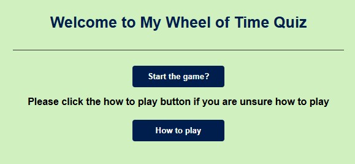
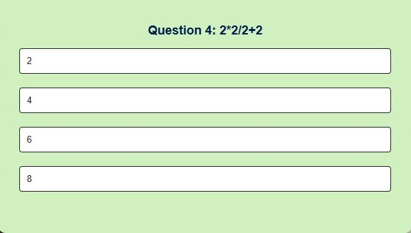
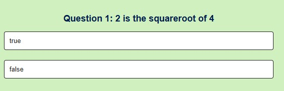
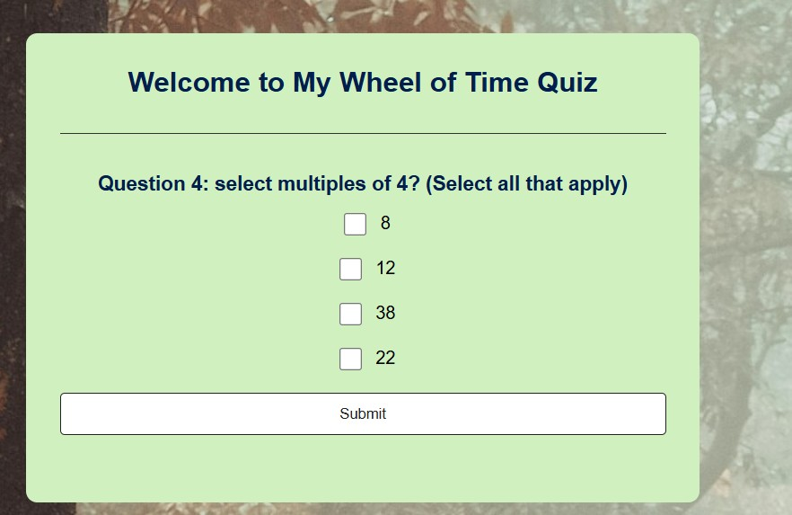
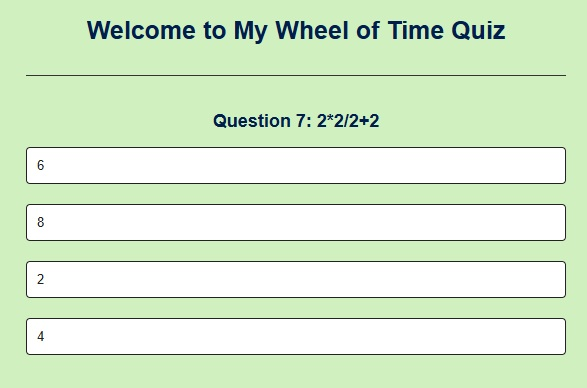
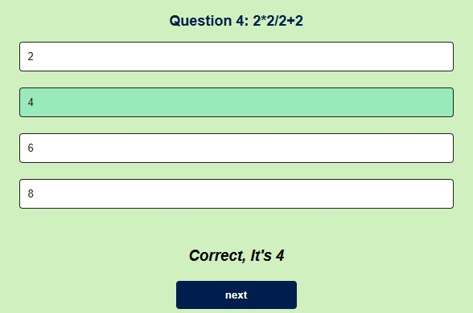
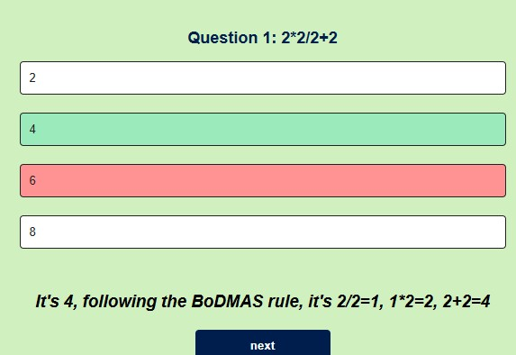
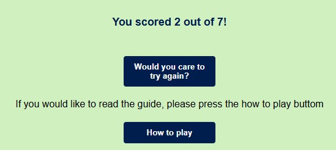
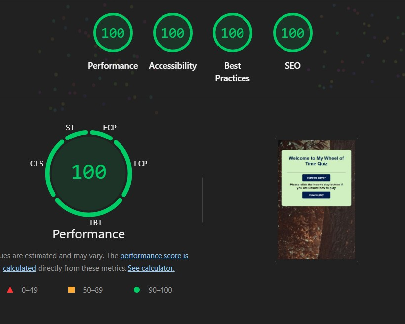

# Project overview

quiz

# Functionalities

The Website itself has a heavy relience on <button> from begining to end.

There are multiple choice questions as well as True or False questions and multiple answer questions.

Both the Question order and Anwsers are Randomised to avoid easy answers.

when correct the answer is green and some flavour text appears to validate your choice.

If the answer is incorrect, then the answer you chose is highligted in red and the correct answer is highlighted in green. there is also some flavour text to inform you which is the correct answer and why.

At the end of the game the score for the quiz 

# Technologies

HTML - used as a base for the site.
CSS - used for display and control elements.
CSS flexbox - flexbox was used for the layout.
Javascript - Used for quiz Functionality and control of elements.
The Fisher-Yates algorithm - for controlled randomisation of question elements
VSCode - the IDE.
GitHub - the host for the version control.
Git - the version control method.

# Accessibility

# Notes

The HTML validator(https://validator.w3.org/) found the errors with three placeholder links on the about me page. It also did not like the blanck src=" " on my modal on the gallery page.
the CSS Validator(https://jigsaw.w3.org/) found no issues.

# Sources/Resources

StackOverflow, W3schools, Various books including Javascript in easy steps and javascript ninja.
The background Image used was sourced from https://unsplash.com/ 
html formatted with https://www.freeformatter.com/